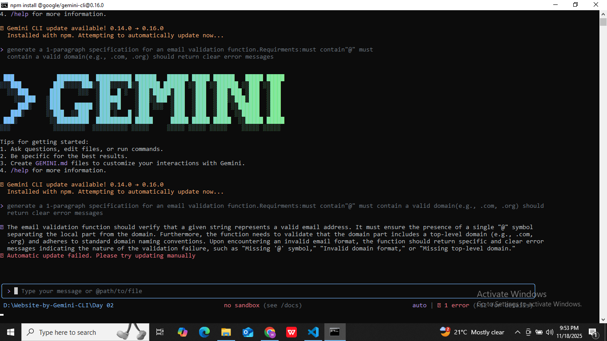

# ✅ AIDD Task02 Solution

# 📁Part A — Theory (Short Questions)

## 1. Nine Pillars Understanding

### Q1(a): Why is using AI Development Agents (like Gemini CLI) for repetitive setup tasks better for your growth as a system architect?

Using AI agents for repetitive setup tasks saves time and reduces errors, so you don’t get stuck doing boring work. Instead, you can focus on designing the overall system, planning architecture, and solving complex problems. This helps you grow as a system architect because you spend more time thinking about how the system works as a whole rather than small, repetitive coding tasks.

### Q1(b): Explain how the Nine Pillars of AIDD help a developer grow into an M-Shaped Developer.

The Nine Pillars guide developers to master multiple skills, not just coding:

By practicing all pillars, a developer becomes versatile in many areas (like the letter M) making them an M-Shaped Developer.

## 2. Vibe Coding vs Specification-Driven Development

### Q2(a): Why does Vibe Coding usually create problems after one week?

Vibe Coding is coding without a clear plan, just improvising as you go. It works in the short term but leads to bugs, messy code, and hard-to-maintain systems after a few days or weeks because nothing is structured.

### Q2(b): How would Specification-Driven Development prevent those problems?

Specification-Driven Development means planning everything first: requirements, design, architecture, and functionality. AI then helps build according to this plan. This prevents confusion, reduces bugs, and makes the system easier to maintain, because every part was clearly defined from the start.

## 3. Architecture Thinking

### Q3(a): How does architecture-first thinking change the role of a developer in AIDD?

Architecture-first thinking makes the developer a system designer, not just a coder. Instead of writing isolated code, the developer focuses on how different parts of the software connect, interact, and scale, making AI a collaborative partner in building a reliable system.

### Q3(b): Explain why developers must think in layers and systems instead of raw code.

Thinking in layers and systems ensures the software is organized, scalable, and maintainable. Raw code alone may work temporarily, but it becomes hard to debug, update, or expand. By thinking in layers, developers see the big picture, manage complexity, and build software that lasts.

# 📁Part B — practical Task

# 📁Part C — Multiple Choice Questions
1. What is the main purpose of Spec-Driven Development?

    a. Make coding faster            
    b. Clear requirements before coding   begins   ✅  
    c. Remove developers   
    d. Avoid documentation
2. What is the biggest mindset shift in AI-Driven Development?

    a. Writing more code manually  
    b. Thinking in systems and clear instructions   ✅  
    c. Memorizing more syntax  
    d. Working without any tools
3. Biggest failure of Vibe Coding?

    a. AI stops responding  
    b. Architecture becomes hard to extend  ✅  
    c. Code runs slow   
    d. Fewer comments written
4. Main advantage of using AI CLI agents (like Gemini CLI)?

    a. They replace the developer completely        
    b. Handle repetitive tasks so dev      focuses on design & problem-solving ✅   
    c. Make coding faster but less reliable  
    d. Make coding optional

5. What defines an M-Shaped Developer?

    a. Knows little about everything  
    b. Deep in only one field  
    c. Deep skills in multiple related domains  ✅  
    d. Works without AI tools