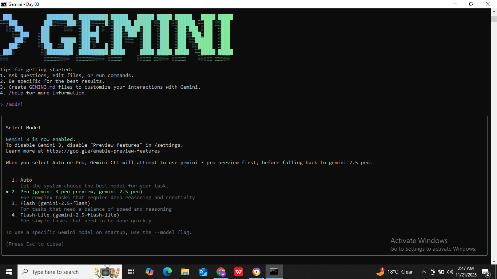

# ✅ AIDD Task03 Solution

## Part A - Research (Short Questions/Answers)

### 1. What new improvements were introduced in Gemini 3.0?

Gemini 3.0 has better deep thinking a much larger context window and improved understanding of images, videos, and long content. It is also more accurate and safer than older versions.

### 2. How does Gemini 3.0 improve coding & automation workflows?

It supports “vibe coding” (turning natural-language prompts into full apps), and via Google Antigravity, AI agents can autonomously plan, write, test, and validate code using editor, terminal, and browser. 

### 3. How does Gemini 3.0 improve multimodal understanding?
Gemini 3.0 can understand text, images, audio, and video together with better accuracy. It handles long videos, detailed scenes, and mixed inputs more effectively.

### 4. Name any two developer tools introduced with Gemini 3.0.

1. Google Antigravity (agent-first development platform)

2. Gemini CLI / API for integrating the model into workflows via Google AI Studio.

## Part B - Practical Task

