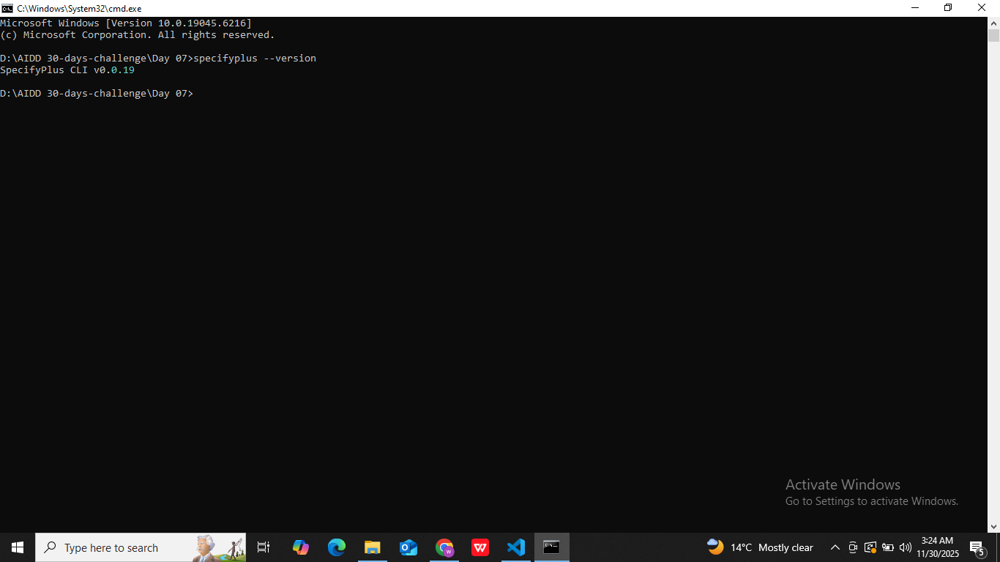

# ✅ AIDD Task02 Solution
## 🌐 What is SPECKit Plus?
SPECKit Plus is an AI-native development framework that helps teams build software in a clear, structured, and organized way. It breaks the development process into five simple phases, allowing you to define your idea, plan your system, assign tasks, and implement everything step-by-step. The goal is to make software development more predictable, collaborative, and AI-assisted.
It ensures every project starts with clarity and ends with a well-structured implementation.

# SPECKit Plus 5 Phases

## 1️⃣ /constitution
**Definition:**  
This phase builds the foundation of the entire project by defining its purpose, mission, and the problem it solves.

 
- Clarifies mission and vision  
- Defines core problem and value  
- Sets guiding principles  
- Aligns the whole team  
- Acts as the “rulebook” for the project  

---
## 2️⃣ /specify
**Definition:**  
This phase converts the idea into clear, detailed requirements that explain exactly what the system must do. 
- Defines scope and features  
- Writes user stories and acceptance criteria  
- Removes confusion with detailed descriptions  
- Converts ideas into actionable specifications  
- Ensures clarity on *what* will be built  

---

## 3️⃣ /plan
**Definition:**  
This phase structures the work by creating architecture, timelines, and strategies for execution.
- Breaks system into modules  
- Creates architecture outlines and flow diagrams  
- Sets priorities and timelines  
- Defines development strategy  
- Makes the execution predictable and smooth  

---

## 4️⃣ /tasks
**Definition:**  
This phase turns the plan into small, manageable, and trackable tasks.
- Creates task list with clear details  
- Defines steps, expected outputs, and priorities  
- Improves collaboration and tracking  
- Supports automation with well-defined units  
- Ensures smooth execution of the plan  

---

## 5️⃣ /implement
**Definition:**  
This phase is where actual coding, testing, and system integration happen.
- Code tasks one by one  
- Use AI tools and agents for assistance  
- Test components and fix errors  
- Integrate modules into a final product  
- Deliver working, structured software  

---

## SPECKit-Plus Installation:
**Install the framework**
```bash
pip install specifyplus
```
## Verify installation
```bash
specifyplus --version
```

