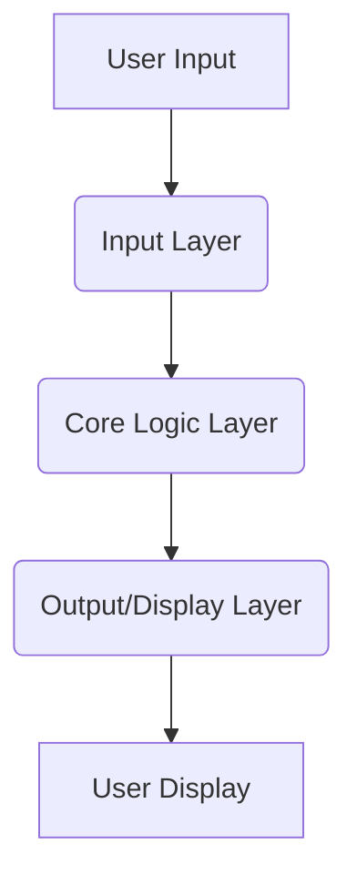

# Implementation Plan: Simple Calculator App

**Branch**: `001-calculator-app` | **Date**: 2025-12-03 | **Spec**: [specs/001-calculator-app/spec.md](specs/001-calculator-app/spec.md)
**Input**: Feature specification from `/specs/001-calculator-app/spec.md`

**Note**: This template is filled in by the `/sp.plan` command. See `.specify/templates/commands/plan.md` for the execution workflow.

## Summary

Provide a simple, intuitive, and accurate calculator for basic arithmetic operations. The technical approach involves developing a standalone application that adheres to mathematical order of operations, handles various numeric inputs, and provides clear error messaging for edge cases like division by zero. The application will prioritize performance and usability, ensuring quick response times and a straightforward user experience.

## Technical Context

**Language/Version**: Python 3.11
**Primary Dependencies**: Standard libraries inherent to the chosen language. Minimal external dependencies.
**Storage**: N/A (No persistent storage required)
**Testing**: Pytest
**Target Platform**: Command-Line Interface (CLI)
**Project Type**: Single project
**Performance Goals**: Display results for basic operations within 100 milliseconds; Application startup time less than 2 seconds.
**Constraints**: Standalone application; No external network dependencies for core functionality; Adhere to standard mathematical order of operations; Limited to basic arithmetic operations.
**Scale/Scope**: Basic calculations (addition, subtraction, multiplication, division); Integer and floating-point number support; Clear display of input and results; User-friendly interface; Offline functionality.

## Constitution Check

*GATE: Must pass before Phase 0 research. Re-check after Phase 1 design.*

- [x] **Problem Statement Alignment**: The plan addresses the need for a straightforward, easy-to-use, offline-capable tool for basic arithmetic.
- [x] **Scope Adherence**: The plan respects the in-scope and out-of-scope items defined in the constitution.
- [x] **Objectives Fulfillment**: The plan aligns with objectives of accurate results, intuitive UX, lightweight, fast response times, and high code quality/test coverage.
- [x] **Constraints Compliance**: All specified constraints (standalone, no external network, order of operations, basic arithmetic only) are honored.
- [x] **Success Criteria Focus**: The plan aims to achieve the measurable success criteria for accuracy, performance, startup time, test coverage, and user satisfaction.

## Project Structure

### Documentation (this feature)

```text
specs/001-calculator-app/
├── plan.md              # This file (/sp.plan command output)
├── research.md          # Phase 0 output (/sp.plan command)
├── data-model.md        # Phase 1 output (/sp.plan command)
├── quickstart.md        # Phase 1 output (/sp.plan command)
├── contracts/           # Phase 1 output (/sp.plan command)
└── tasks.md             # Phase 2 output (/sp.tasks command - NOT created by /sp.plan)
```

### Source Code (repository root)

```text
src/
├── main.py              # Main application entry point
├── calculator_core.py   # Core calculation logic (arithmetic operations, order of operations)
├── input_parser.py      # Handles parsing user input
├── display_manager.py   # Manages output display
└── utils.py             # Utility functions (e.g., error handling, number formatting)

tests/
├── unit/
│   ├── test_calculator_core.py
│   └── test_input_parser.py
├── integration/
│   └── test_full_workflow.py
└── edge_cases/
    └── test_edge_cases.py
```

**Structure Decision**: A single project structure with clearly separated modules for core logic, input parsing, and display management, along with a dedicated testing directory for unit, integration, and edge case tests.

## Architecture Overview

### Layered Architecture

The application will follow a layered architectural pattern to ensure separation of concerns, testability, and maintainability.

1.  **Input Layer**: Responsible for receiving and processing raw user input.
    *   **Components**: `input_parser.py` (CLI input handling, tokenization, basic validation).
    *   **Responsibilities**: Read input, convert to an internal representation (e.g., list of numbers and operators), handle user commands like 'clear'.
2.  **Core Logic Layer**: Contains the fundamental arithmetic engine and business rules.
    *   **Components**: `calculator_core.py` (implements addition, subtraction, multiplication, division, applies order of operations).
    *   **Responsibilities**: Perform calculations, manage intermediate results, detect and signal errors (e.g., division by zero, overflow).
3.  **Output/Display Layer**: Manages how results and messages are presented to the user.
    *   **Components**: `display_manager.py` (formats numbers, displays results, shows error messages).
    *   **Responsibilities**: Render calculation outcomes clearly and provide user feedback.



## Pseudocode (Core Calculation Logic)

```pseudocode
FUNCTION calculate(expression_tokens):
    IF expression_tokens is empty:
        RETURN 0

    // Convert infix to postfix (Shunting-yard algorithm concept)
    postfix_tokens = convert_to_postfix(expression_tokens)

    // Evaluate postfix expression
    stack = new Stack()
    FOR EACH token IN postfix_tokens:
        IF token IS a number:
            stack.push(token)
        ELSE IF token IS an operator:
            operand2 = stack.pop()
            operand1 = stack.pop()
            result = apply_operator(operand1, operand2, token)
            stack.push(result)
        ELSE IF token IS 'clear' or 'clear_entry':
            // Handle clear logic based on specific implementation
            RESET_CALCULATOR_STATE()
            RETURN 0 // Or appropriate cleared value
    RETURN stack.pop()

FUNCTION apply_operator(operand1, operand2, operator):
    SWITCH operator:
        CASE '+': RETURN operand1 + operand2
        CASE '-': RETURN operand1 - operand2
        CASE '*': RETURN operand1 * operand2
        CASE '/':
            IF operand2 IS 0:
                SIGNAL_ERROR("Division by zero")
                RETURN ERROR_VALUE
            ELSE: RETURN operand1 / operand2
        DEFAULT: SIGNAL_ERROR("Unknown operator")
                 RETURN ERROR_VALUE
```

## Testing Plan

A comprehensive testing strategy will be implemented covering various levels to ensure reliability and accuracy.

### 1. Unit Tests

*   **Focus**: Individual functions and methods within `calculator_core.py`, `input_parser.py`, and `display_manager.py`.
*   **Tools**: [NEEDS CLARIFICATION: Specify the unit testing framework (e.g., Pytest, Jest, JUnit)]
*   **Coverage**: Target 90%+ code coverage for core logic.
*   **Scenarios**: Test each arithmetic operation, number parsing, operator precedence, and display formatting in isolation.

### 2. Integration Tests

*   **Focus**: Interactions between modules, particularly the flow from input parsing through calculation to output display.
*   **Scenarios**: Simulate full user interactions for basic calculations, clear operations, and chained operations to ensure components work together as expected.

### 3. Edge Case Tests

*   **Focus**: Specific boundary conditions and error scenarios identified in the `spec.md`.
*   **Scenarios**:
    *   Division by zero.
    *   Extremely large/small numbers (overflow/underflow).
    *   Invalid input sequences (if applicable to chosen input method).

### 4. Usability Testing (Manual/User Feedback)

*   **Focus**: User experience and adherence to NFR-003.
*   **Method**: Conduct simple user tests to observe interaction flow and gather feedback on intuitiveness and ease of use.

## Timeline Estimate

*Timeline estimates are not provided as part of this planning phase, focusing instead on detailed technical breakdown.*